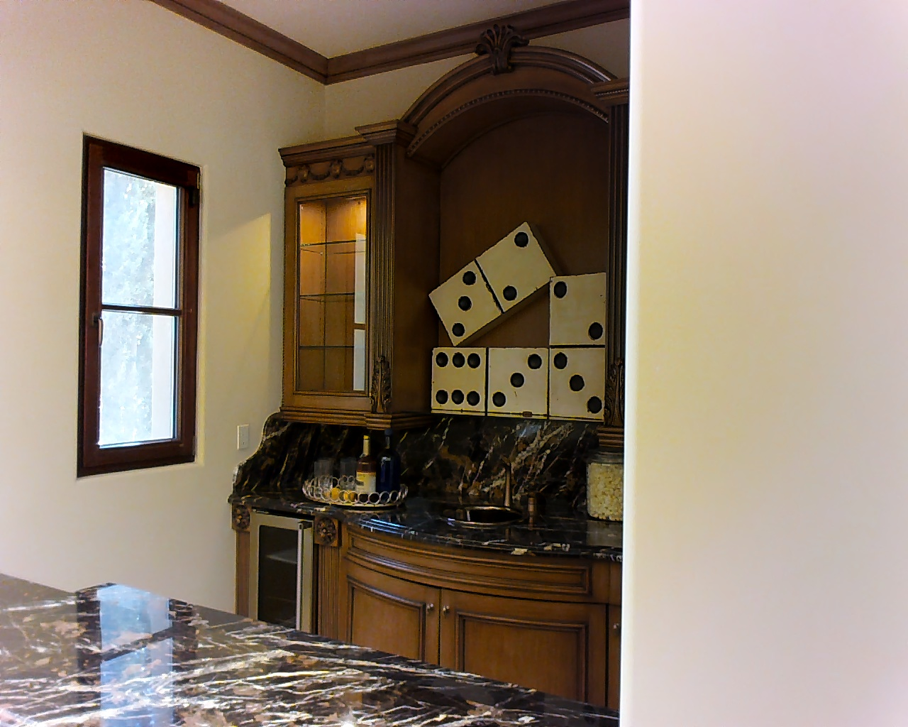

<div align="center">

# SenseNova-SI: 探索空间智能在多模态基座模型上的尺度效应

</div>

<div align="center">


[English](README.md) | 简体中文

<p align="center">
    <a href="https://huggingface.co/collections/sensenova/sensenova-si" target="_blank">
        
    </a>
    <a href="https://arxiv.org/abs/2511.13719" target="_blank">
        
    </a>
    <a href="https://huggingface.co/spaces/lmms-lab-si/EASI-Leaderboard" target="_blank">
        
    </a>
    <a href="https://github.com/EvolvingLMMs-Lab/EASI" target="_blank">
        
    </a>
    <a href="https://github.com/OpenSenseNova/SenseNova-SI/blob/main/LICENSE"></a>
</p>

</div>


## 概览
尽管多模态基座模型已取得显著进展，但在空间智能方面仍存在明显不足。
本研究基于成熟的多模态基础，包括视觉理解模型（如Qwen3-VL、InternVL3）和统一理解生成模型（如Bagel），从尺度效应（Scaling）的视角构建了**SenseNova-SI系列模型**。
我们采用系统化方法构建了包含800万样本的SenseNova-SI-8M数据集，通过严格的空间能力分类体系培养高性能、高鲁棒性的空间能力。
该系列模型在多项空间智能基准测试中取得突破性表现：VSI-Bench 68.7%、MMSI 43.3%、MindCube 85.6%、ViewSpatial 54.6%、SITE 50.1%，同时保持强大的通用多模态理解能力（如MMBench-En 84.9%）。
本研究进一步分析了数据规模的影响，揭示了多样化数据训练带来的涌现泛化能力，探讨了过拟合与语言捷径的风险，提出了空间思维链推理的初步研究，并验证了下游应用潜力。
SenseNova-SI是一个持续迭代的项目，所有新训练的多模态空间智能基础模型均将陆续开源，以推动空间智能领域的研究发展。
*后续 SenseNova-SI 将与更大规模的内部模型进行集成。*

## 发布信息
目前，我们基于流行的开源基础模型构建 SenseNova-SI，以最大化与现有研究流程的兼容性。
在本次发布中，我们推出
[**SenseNova-SI-1.1-InternVL3-2B**](https://huggingface.co/sensenova/SenseNova-SI-1.1-InternVL3-2B) 与 
[**SenseNova-SI-1.1-InternVL3-8B**](https://huggingface.co/sensenova/SenseNova-SI-1.1-InternVL3-8B)，
在五个近期发布的空间智能基准测试（**VSI**、**MMSI**、**MindCube**、**ViewSpatial**、**SITE**）上，
在同等模型规模下均取得了开源模型的最新最优性能（state-of-the-art）。

<table>
  <thead>
    <tr>
      <th>Model</th>
      <th>VSI</th>
      <th>MMSI</th>
      <th>MindCube-Tiny</th>
      <th>ViewSpatial</th>
      <th>SITE</th>
    </tr>
  </thead>
  <tbody>
    <tr>
      <td colspan="6" align="center"><em>Open-source Models (~2B)</em></td>
    </tr>
    <tr>
      <td>InternVL3-2B</td><td>32.9</td><td>26.5</td><td>37.5</td><td>32.5</td><td>30.0</td>
    </tr>
    <tr>
      <td>Qwen3-VL-2B-Instruct</td><td>50.3</td><td>28.9</td><td>34.5</td><td>36.9</td><td>35.6</td>
    </tr>
    <tr>
      <td>MindCube-3B-RawQA-SFT</td><td>17.2</td><td>1.7</td><td>51.7</td><td>24.1</td><td>6.3</td>
    </tr>
    <tr>
      <td>SpatialLadder-3B</td><td>44.8</td><td>27.4</td><td>43.4</td><td>39.8</td><td>27.9</td>
    </tr>
    <tr>
      <td>SpatialMLLM-4B</td><td>46.3</td><td>26.1</td><td>33.4</td><td>34.6</td><td>18.0</td>
    </tr>
    <tr>
      <td>VST-3B-SFT</td><td>57.9</td><td>30.2</td><td>35.9</td><td>52.8</td><td>35.8</td>
    </tr>
    <tr>
      <td>Cambrian-S-3B</td><td>57.3</td><td>25.2</td><td>32.5</td><td>39.0</td><td>28.3</td>
    </tr>
    <tr>
      <td><strong>SenseNova-SI-1.1-InternVL3-2B</strong></td>
      <td><strong>63.7</strong></td>
      <td><strong>34.2</strong></td>
      <td><strong>41.8</strong></td>
      <td><strong>52.6</strong></td>
      <td><strong>36.7</strong></td>
    </tr>
    <tr>
      <td colspan="6" align="center"><em>Open-source Models (~8B)</em></td>
    </tr>
    <tr>
      <td>InternVL3-8B</td><td>42.1</td><td>28.0</td><td>41.5</td><td>38.6</td><td>41.1</td>
    </tr>
    <tr>
      <td>Qwen3-VL-8B-Instruct</td><td>57.9</td><td>31.1</td><td>29.4</td><td>42.2</td><td>45.8</td>
    </tr>
    <tr>
      <td>BAGEL-7B-MoT</td><td>31.4</td><td>31.0</td><td>34.7</td><td>41.3</td><td>37.0</td>
    </tr>
    <tr>
      <td>SpaceR-7B</td><td>41.5</td><td>27.4</td><td>37.9</td><td>35.8</td><td>34.2</td>
    </tr>
    <tr>
      <td>ViLaSR-7B</td><td>44.6</td><td>30.2</td><td>35.1</td><td>35.7</td><td>38.7</td>
    </tr>
    <tr>
      <td>VST-7B-SFT</td><td>60.6</td><td>32.0</td><td>39.7</td><td>50.5</td><td>39.6</td>
    </tr>
    <tr>
      <td>Cambrian-S-7B</td><td>67.5</td><td>25.8</td><td>39.6</td><td>40.9</td><td>33.0</td>
    </tr>
    <tr>
      <td><strong>SenseNova-SI-1.1-InternVL3-8B</strong></td>
      <td><strong>68.7</strong></td>
      <td><strong>43.3</strong></td>
      <td><strong>85.6</strong></td>
      <td><strong>54.6</strong></td>
      <td><strong>47.7</strong></td>
    </tr>
    <tr>
      <td colspan="6" align="center"><em>Proprietary Models</em></td>
    </tr>
    <tr>
      <td>Gemini-2.5-pro-2025-06</td><td>53.5</td><td>38.0</td><td>57.6</td><td>46.0</td><td>57.0</td>
    </tr>
    <tr>
      <td>Grok-4-2025-07-09</td><td>47.9</td><td>37.8</td><td>63.5</td><td>43.2</td><td>47.0</td>
    </tr>
    <tr>
      <td>GPT-5-2025-08-07</td><td>55.0</td><td>41.8</td><td>56.3</td><td>45.5</td><td>61.8</td>
    </tr>
  </tbody>
</table>


## 🛠️ 快速上手

### 安装

我们推荐使用 [uv](https://docs.astral.sh/uv/) 来管理环境。

> uv 安装指南: <https://docs.astral.sh/uv/getting-started/installation/#installing-uv>

```bash
git clone git@github.com:OpenSenseNova/SenseNova-SI.git
cd SenseNova-SI/
uv sync --extra cu124 # 或以下值之一: [cu118|cu121|cu124|cu126|cu128|cu129], 取决于您的 CUDA 版本
source .venv/bin/activate
```

#### Hello World

无需图像的简单测试，以验证环境是否正确配置，并下载模型。

```bash
python example.py \
  --question "Hello" \
  --model_path sensenova/SenseNova-SI-1.1-InternVL3-8B
```

### 示例

#### 示例1

该例题源自[MMSI-Bench](https://github.com/InternRobotics/MMSI-Bench)的`Pos-Obj-Obj`子集:

```bash
python example.py \
  --image_paths examples/Q1_1.png examples/Q1_2.png \
  --question "<image><image>\nYou are standing in front of the dice pattern and observing it. Where is the desk lamp approximately located relative to you?\nOptions: A: 90 degrees counterclockwise, B: 90 degrees clockwise, C: 135 degrees counterclockwise, D: 135 degrees clockwise" \
  --model_path sensenova/SenseNova-SI-1.1-InternVL3-8B 
# --model_path OpenGVLab/InternVL3-8B 
```

<!-- Example 1 -->
<details open>
  <summary><strong>示例1详情</strong></summary>
  <p><strong>Q:</strong> <image><image>\nYou are standing in front of the dice pattern and observing it. Where is the desk lamp approximately located relative to you?\nOptions: A: 90 degrees counterclockwise, B: 90 degrees clockwise, C: 135 degrees counterclockwise, D: 135 degrees clockwise</p>
  <table>
    <tr>
      <td align="center" width="50%" style="padding:4px;">
        
      </td>
      <td align="center" width="50%" style="padding:4px;">
        
      </td>
    </tr>
  </table>
  <p><strong>正确答案: C</strong></p>
</details>

#### 示例2

该例题源自[MindCube](https://mind-cube.github.io/)的`Rotation`子集:

```bash
python example.py \
  --image_paths examples/Q2_1.png examples/Q2_2.png \
  --question "<image><image>\nBased on these two views showing the same scene: in which direction did I move from the first view to the second view?\nA. Directly left B. Directly right C. Diagonally forward and right D. Diagonally forward and left" \
  --model_path sensenova/SenseNova-SI-1.1-InternVL3-8B 
# --model_path OpenGVLab/InternVL3-8B
```

<!-- Example 2 -->
<details open>
  <summary><strong>示例2详情</strong></summary>
  <p><strong>Q:</strong> Based on these two views showing the same scene: in which direction did I move from the first view to the second view?\nDirectly left B. Directly right C. Diagonally forward and right D. Diagonally forward and left</p>
  <table>
    <tr>
      <td align="center" width="50%" style="padding:4px;">
        
      </td>
      <td align="center" width="50%" style="padding:4px;">
        
      </td>
    </tr>
  </table>
  <p><strong>正确答案: D</strong></p>
</details>


#### 一次测试多个问题

构建类似于[examples/examples.jsonl](examples/examples.jsonl)的文件，每一行代表一个问题。

模型只加载一次，按逐行的顺序逐个回答问题，问题之间互不干扰。

> `jsonl`更详细的格式可以参考[单图数据](https://internvl.readthedocs.io/en/latest/get_started/chat_data_format.html#single-image-data)和[多图数据](https://internvl.readthedocs.io/en/latest/get_started/chat_data_format.html#multi-image-data)

```bash
python example.py \
  --jsonl_path examples/examples.jsonl \
  --model_path sensenova/SenseNova-SI-1.1-InternVL3-8B 
# --model_path OpenGVLab/InternVL3-8B 
```

### 评测

如需复现上述基准测试结果，请参考 [EASI](https://github.com/EvolvingLMMs-Lab/EASI) 在主流空间智能基准上评估 SenseNova-SI 的表现。


## 🖊️ 引用

```bib
@article{sensenova-si,
  title = {Scaling Spatial Intelligence with Multimodal Foundation Models},
  author = {Cai, Zhongang and Wang, Ruisi and Gu, Chenyang and Pu, Fanyi and Xu, Junxiang and Wang, Yubo and Yin, Wanqi and Yang, Zhitao and Wei, Chen and Sun, Qingping and Zhou, Tongxi and Li, Jiaqi and Pang, Hui En and Qian, Oscar and Wei, Yukun and Lin, Zhiqian and Shi, Xuanke and Deng, Kewang and Han, Xiaoyang and Chen, Zukai and Fan, Xiangyu and Deng, Hanming and Lu, Lewei and Pan, Liang and Li, Bo and Liu, Ziwei and Wang, Quan and Lin, Dahua and Yang, Lei},
  journal = {arXiv preprint arXiv:2511.13719},
  year = {2025}
}
```